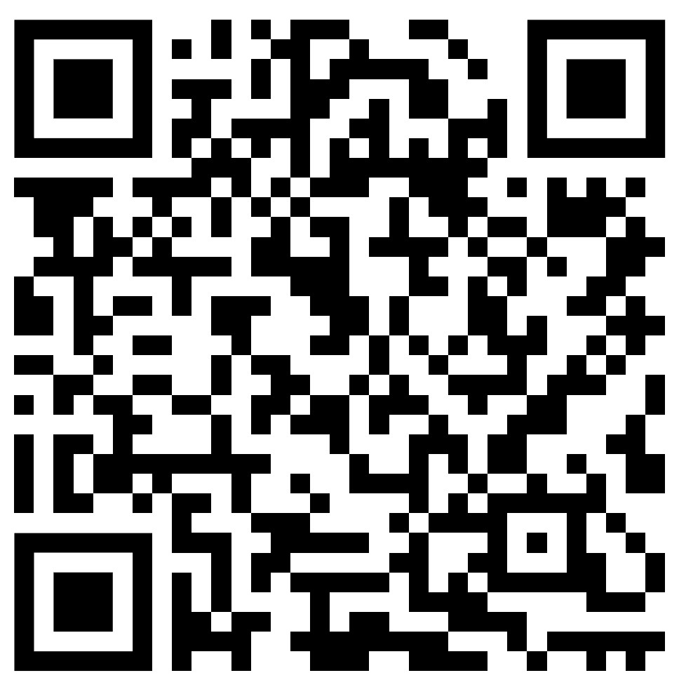

# Вопросы с партнером

## Описание
Последним этапом части `Raagimine` (Говорение) нужно ро выданной карте идей задавать вопросы партнеру и отвечать на вопросы партнера.

Партнером будет такой же экзаменуемый и незнакомый Вам человек, поэтому может быть непросто понять с непривычки его речь.

Было бы неплохо познакомиться со своим будущим партнером заранее и попробовать потренироваться, задавая друг другу вопросы.

Это позволит узнать человека поближе, привыкнуть к его голосу и произношению, а также заранее увидеть, какие вопросы ему можно будет задавать на самом экзамене.

Ниже приведен список простых вопросов, которые можно задавать друг другу.

Также приведен QR-код этой страницы, который может считать телефоном ваш партнер и открыть в телефоне эту же страницу с вопросами.

Далее вы будете задавать вопросы друг другу.

Например, вы можете задавать вопросы сверху вниз, а ваш партнер будет вам задавать вопросы снизу вверх.

## Код страницы

## Вопросы
Mis sinu nimi on? - Как тебя зовут?

Mis sinu perekonnanimi on? - Как твоя фамилия?

Kui vana sa oled? - Сколько тебе лет?

Kus sa sündisid? - Где ты родился?

Millal sa sündisid? - Когда ты родился?

Mis aastal sa sündisid? - В каком году ты родился?

Mis kuupäeval sa sündisid? - В какой день месяца ты родился?

Kust sa pärit oled? - Откуда ты родом?

Kus sa elad? - Где ты живешь?

Kus sa varem elasid? - Где ты раньше жил?

Kellena sa töötad? - Кем ты работаешь?

Kus sa töötad? - Где ты работаешь?

Millega sa tööle sõidad? - Чем ты добираешься на работу?

Millal sinu tööpäev algab ja lõpeb? - Когда начинается и заканчивается твой рабочий день?

Millal sa hommikul ärkad? - Когда ты утром просыпаешься?

Mida sa hommikusöögiks sööd? - Что ты ешь на завтрак?

Mis on sinu lemmikhommikusöök? - Какая твоя любимая еда на завтрак?

Mis on sinu lemmiktoit? - Какая твоя любимая еда?

Kas sulle maitsev jäätis? - Тебе нравится мороженое?

Mida sa tööpäeva õhtul teed? - Что ты делаешь в рабочий день вечером?

Mida sa nädalavahetusel teed? - Что ты делаешь на выходных?

Mida sa talvel teed? - Что ты делаешь, когда зима?

Kas sa oskad suusatada? - Ты умеешь кататься на лыжах?

Kas sa teed sporti? - Ты занимаешься спортом?

Kas sulle meeldib metsas jalutada? - Ты любишь гулять в лесу?

Kas sulle meeldib reisida? - Ты любишь путешествовать?

Kui tihti sa reisid? - Как часто ты путешествуешь?

Kuhu sa viimati reisisid? - Куда ты путешествовал в последний раз?

Millal sa viimati reisisid? - Когда ты путешествовал последний раз?

Mitmetoaline sinu korter on? - Сколько комнатная у тебя квартира?

Mitmekorruseline sinu maja on? - Сколькиэтажный у тебя дом?

Mitmendal korrusel sa elad? - На каком этаже ты живешь?

Kas sul on suur pere?  - У тебя большая семья?

Kes sinu peres on? - Кто в твоей семье?

Kas sulle meeldib kinos käia? - Ты любишь ходить в кино?

Kas sulle meeldib raamatuid lugeda? - Ты любишь читать книги?

Kelleks sa õppisid? - На кого ты учился?

Kui tihti sa arsti juures käid? - Как часто ты ходишь к врачу?

Kellele sa helistad, kui sa oled haige? - Кому ты звонишь, когда ты болен?

Mis on sinu lemmikaastaaeg? - Какое твое любимое время года?

Kas sul on lemmikloom? - У тебя есть домашнее животное?

Mis sinu kassi nimi on? - Как зовут твою кошку?

Kuhu sa tahad suvel sõita? - Куда ты хочешь летом поехать?

Kas sul on autojuhiluba? - У тебя есть водительские права?

Kellega sa sünnipäeva tähistad? - С кем ты отмечаешь день рождения?

Mis on su lemmikpüha? - Какой твой любимый праздник?

Kas sulle meeldib ujuda? - Тебе нравится плавать?

Kas sa puhkasid sel aastal? - Ты отдыхал в этом году?

Kuhu sa tahad järgmisel aastal sõita? - Куда ты хочешь поехать в следующем году?

Mis on sinu lemmikjook? - Какой твой любимый напиток?

Kui tihti sa turul käid? - Как часто ты ходишь на рынок?

Mida sa poest ostad? - Что ты покупаешь в магазине?

Mis poest sa toitu ostad? - В каком магазине ты покупаешь еду?

Kas sul on vend või õde? - У тебя есть брат или сестра?

Kas sulle meeldib seeni korjata? - Ты любишь собирать грибы?

Mis ilm praegu on? - Какая сейчас погода?

Mis sinu hobi on? - Какое твое хобби?

Mis kell sa magama lähed? - Во сколько ты ложишься спать?

Mida sa igal hommikul teed? - Что ты делаешь каждое утро?

Kas sulle meeldib süüa teha? - Ты любишь готовить?

Mida sa tavaliselt pühapäeval teed? - Что ты обычно делаешь в воскресенье?

Kas sul on kodus lilled? - У тебя дома есть цветы?

Mis sinu maja lähedal on? - Что находится рядом с твоим домом?

Kas sa jood kohvi piimaga või ilma? - Ты пьешь кофе с молоком или без?

Kus sa tavaliselt lõunat sööd? - Где ты обычно обедаешь?

Kas sul on jalgratas? - У тебя есть велосипед?

Mis keeli sa räägid? - На каких языках ты говоришь?

Mis ilm sulle meeldib? - Какая погода тебе нравится?

Kui kaua sa tööle sõidad? - Как долго ты едешь на работу?

Kas sulle meeldib Tallinnas elada? - Тебе нравится жить в Таллине?

Mis on sinu lemmikkoht linnas? - Какое твое любимое место в городе?

## Test

<button id="myButton" onclick="changeButtonText()">Нажми на меня</button>

    