# Руководство для участника виртуальной консультации

## Перед консультацией

1. Проверьте, что у вас есть работающее интернет соединение.  
2. Рекомендуем подключаться к консультации с компьютера, так как отображение на экране телефона может быть неполным.  
3. Проверьте, что на компьютере есть микрофон и динамики.  
4. Убедитесь, что вы скачали на компьютер тетрадь/пособие для консультации [на сайте Haridus- ja Noorteamet](https://harno.ee/eesti-keele-tasemeeksamid#materjalid). Если файлы консультации на сайте не открываются, попробуйте открыть сайт в браузере в режиме инкогнито (приватном режиме).  
5. Выберите для участия в виртуальной консультации тихое место.

## Регистрация на виртуальную консультацию

### Как присоединиться к консультации (через вебинар Teams)

1. Если вы зарегистрировались на экзамен по уровню эстонского языка, вы получите письмо, в котором будет:  
информация об онлайн консультации;  
ссылка на онлайн консультацию (ссылка на вебинар Teams).  

2. После нажатия на ссылку откроется веб страница Teams или приложение.  
Там будет показано окно регистрации, где нужно нажать Register (registreeri).

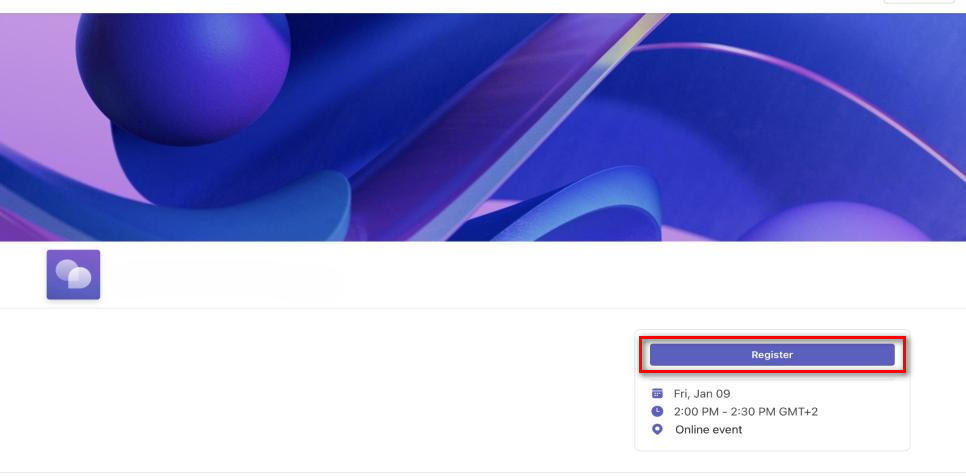

3. Затем отобразится форма регистрации, где нужно указать:  
имя  
фамилию  
адрес электронной почты

4. Затем нажмите Register (registreeri). Проверьте, что вы отметили галочку согласия с условиями.

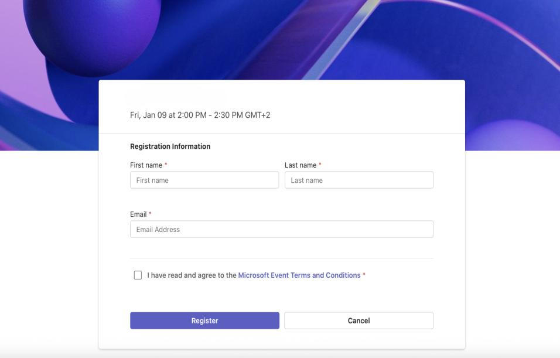

### Подтверждение регистрации по электронной почте

После заполнения формы регистрации на указанный в форме адрес электронной почты придёт письмо с подтверждением регистрации. В нём выберите LIITU (JOIN EVENT).

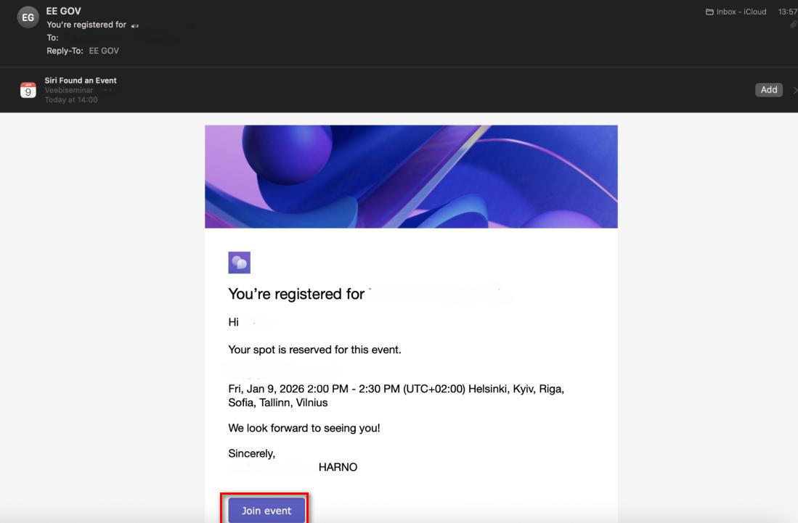

## Подключение через браузер или приложение Teams

После нажатия LIITU (JOIN EVENT) откроется окно, где нужно выбрать, будете ли вы участвовать через браузерную версию (Continue on this browser) или через приложение Teams (Join on the Teams app).  
Если приложение установлено, выбирайте участие через приложение Teams (Join on the Teams app).

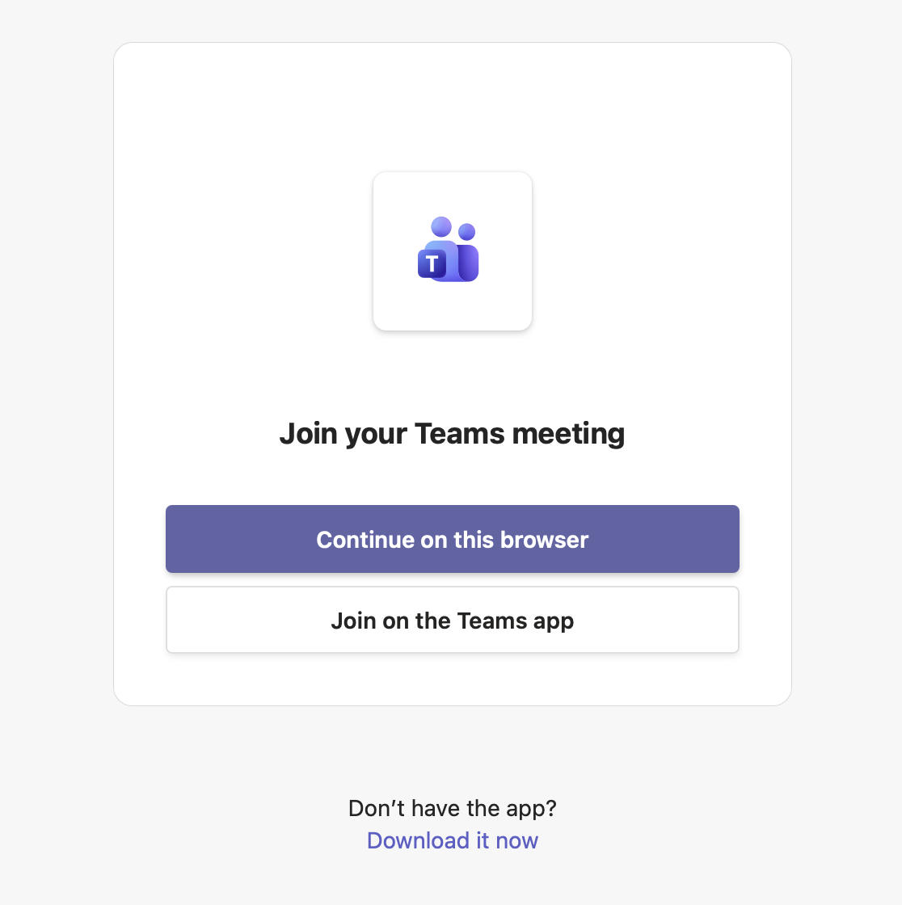

### Перед входом: настройки звука и видео
Перед подключением откроется окно настроек, где можно выбрать, какие микрофон и динамики использовать. В поле LISA OMA NIMI (TYPE YOUR NAME) введите имя и фамилию.

Если микрофон/камера не работают:
- Проверьте, что в приложении Teams на вашем компьютере разрешены микрофон и динамик.  
- Нажмите в окне Teams значок шестерёнки (Seaded/Settings) и выберите правильные микрофон/динамик.

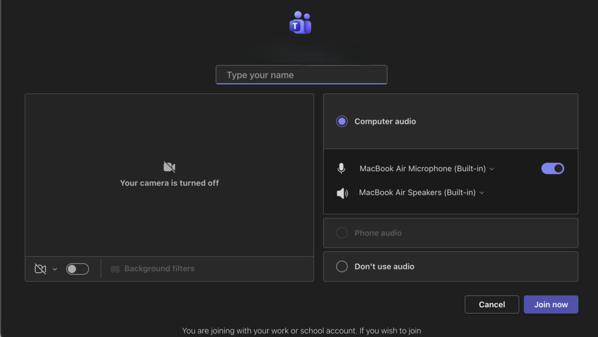

### Зал ожидания
После регистрации откроется зал ожидания.  
- на экране появится сообщение: «Ждём, пока начнётся событие» (This meeting will start shortly);  
- виртуальная консультация начнётся автоматически, когда ведущий её запустит;  
- повторно регистрироваться не нужно, если позже вы снова используете ту же ссылку.  

Когда консультация начнётся, ведущий покажет материалы, демонстрируя экран.

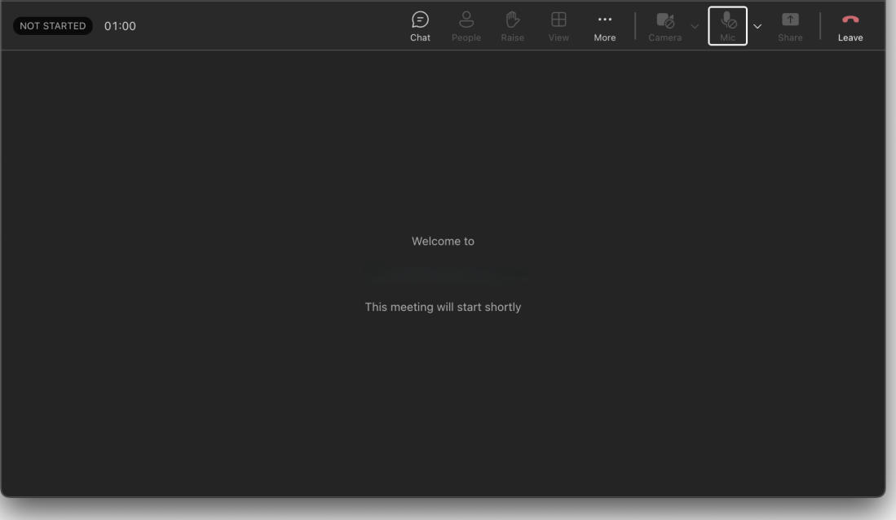

 
### Запросить слово — поднять руку

Если вы хотите сказать что то, нажмите TÕSTA KÄSI (RAISE). Когда ведущий даст слово, вы сможете временно включить микрофон и камеру.

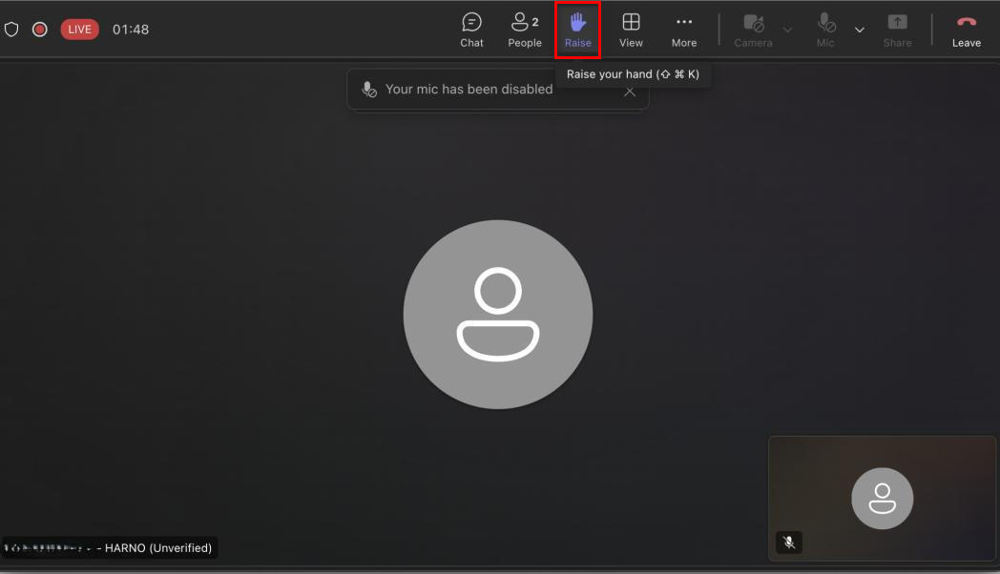

### Проверка настроек камеры и микрофона

Если вы запросили слово, но звук/видео не работают, проверьте настройки микрофона (MIC) и камеры (CAMERA), нажав на стрелки рядом с ними.

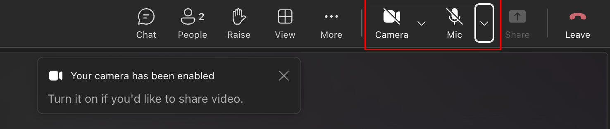

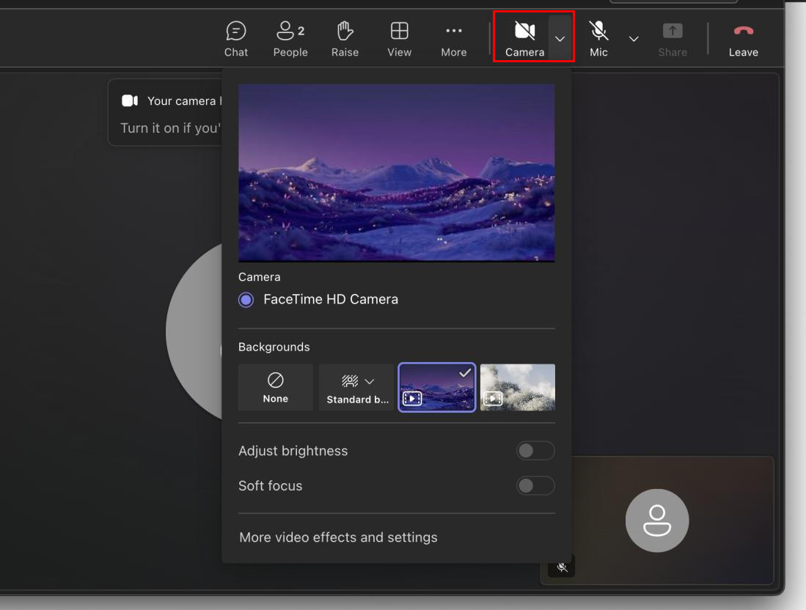

### Проверка звука и микрофона

Проверьте, что и динамики (Speaker), и микрофон (Microphone) активны и не отключены (не на «mute»).

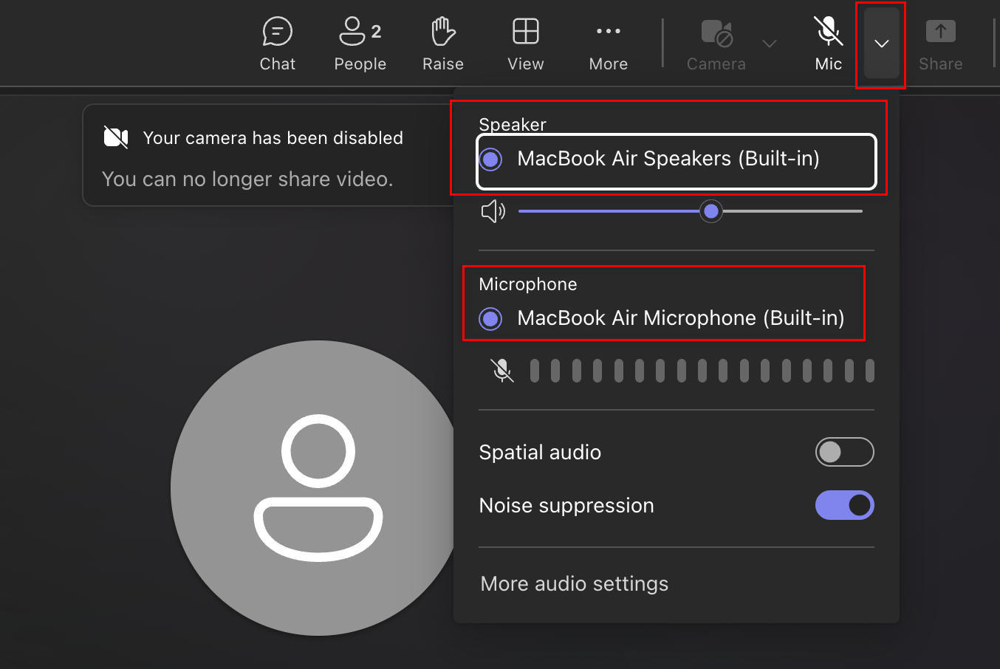

### Открытие чата
Если вы хотите задать вопрос письменно, нажмите значок CHAT и напишите свой вопрос. Когда ведущий увидит ваш вопрос, он ответит по ходу консультации или в конце темы.

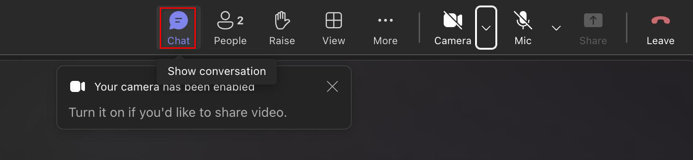

## Окно чата (chat)
Чтобы написать сообщение в окне чата (CHAT), нажмите на поле справа внизу KIRJUTA SÕNUM (TYPE A MESSAGE) и отправьте сообщение, нажав на стрелку внизу поля.

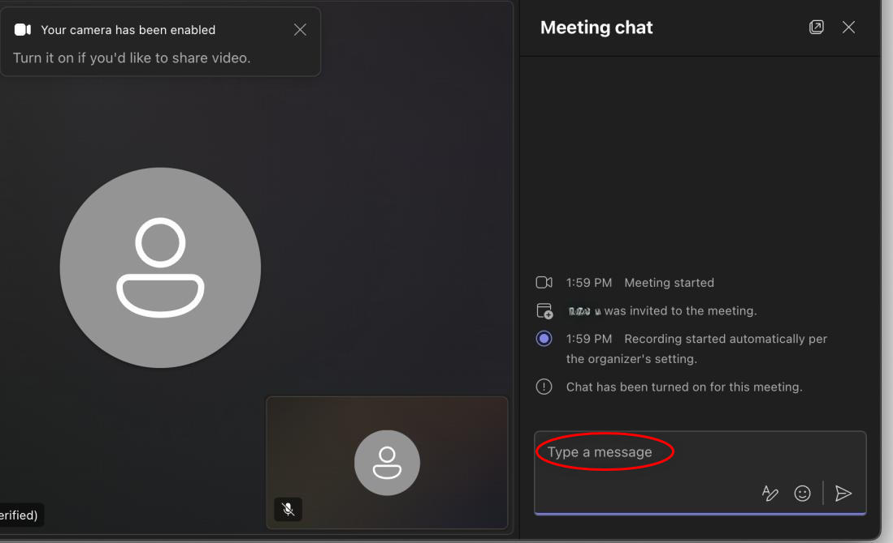

### Выход из виртуальной консультации
Когда консультация закончится, нажмите **LAHKU VESTLUSEST (LEAVE)** и закройте окно..

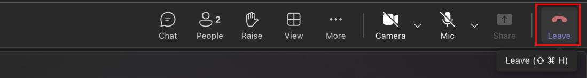