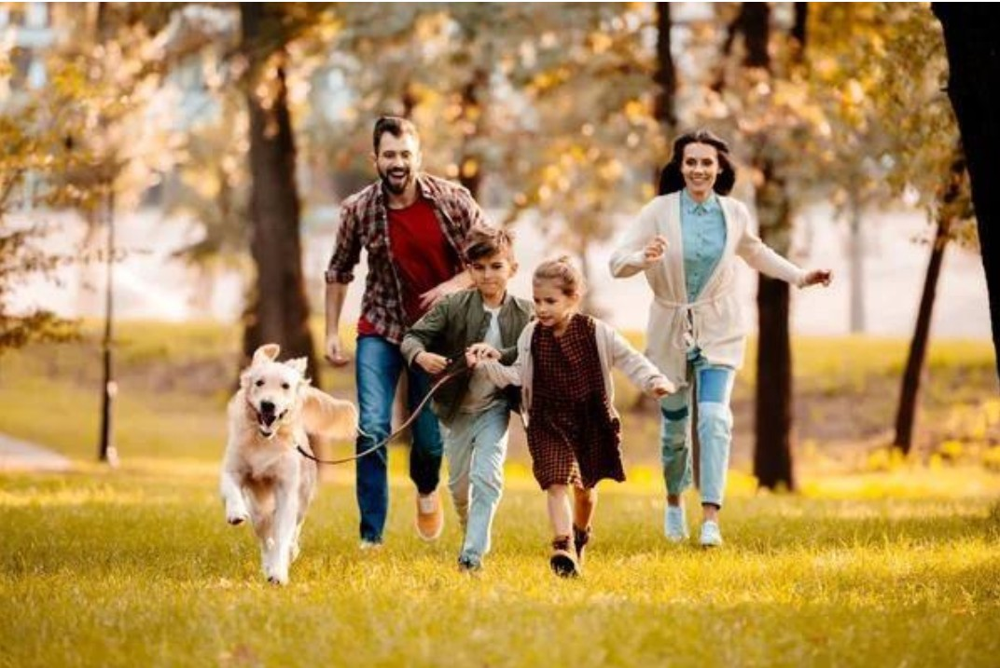
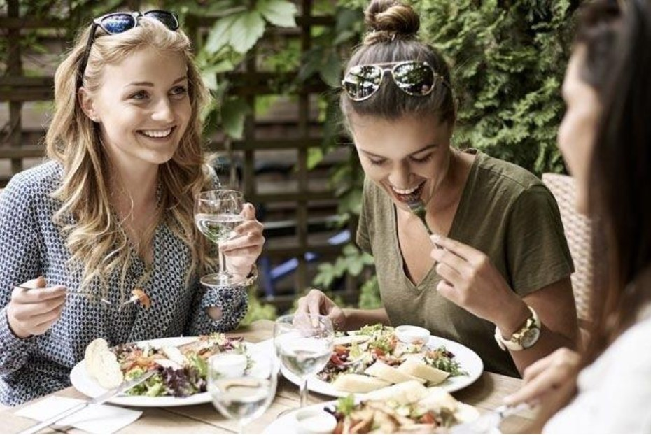
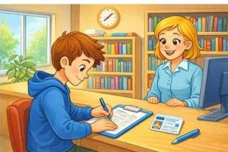
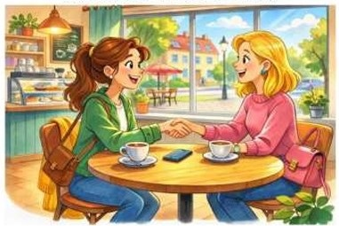
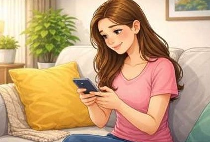
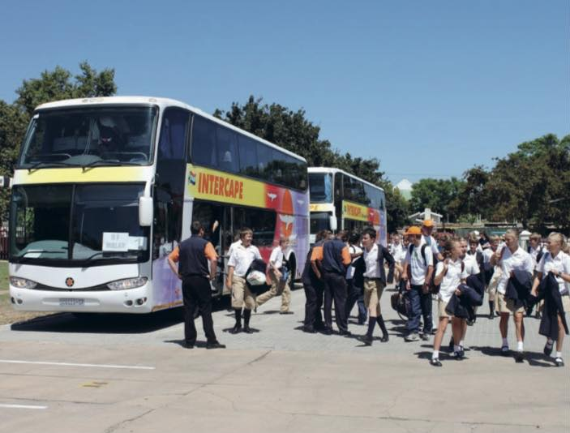
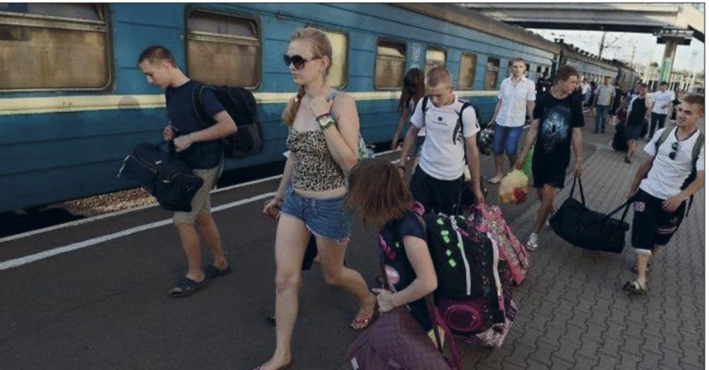
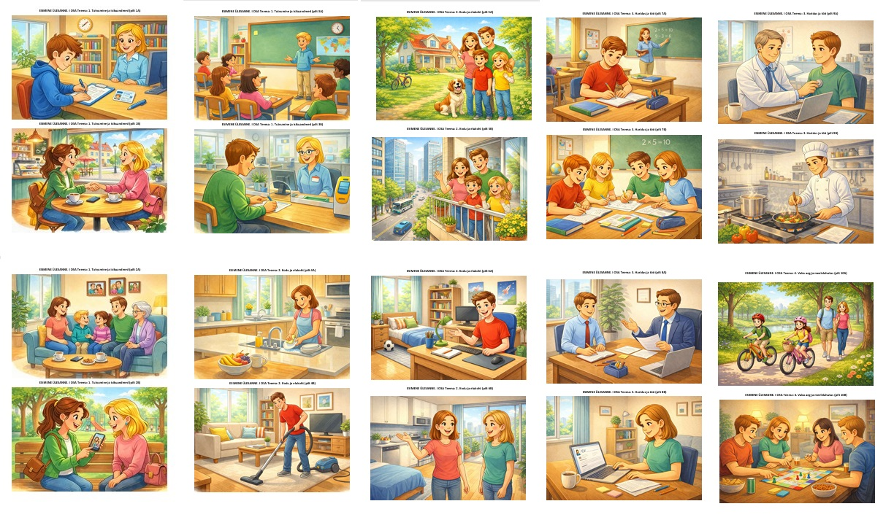
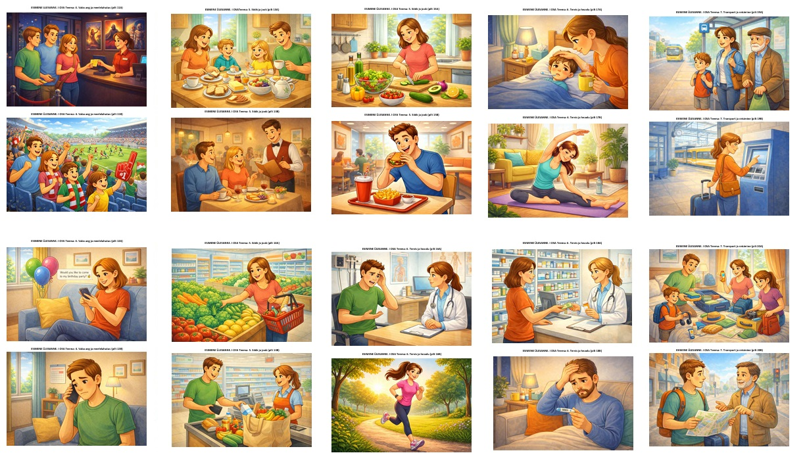
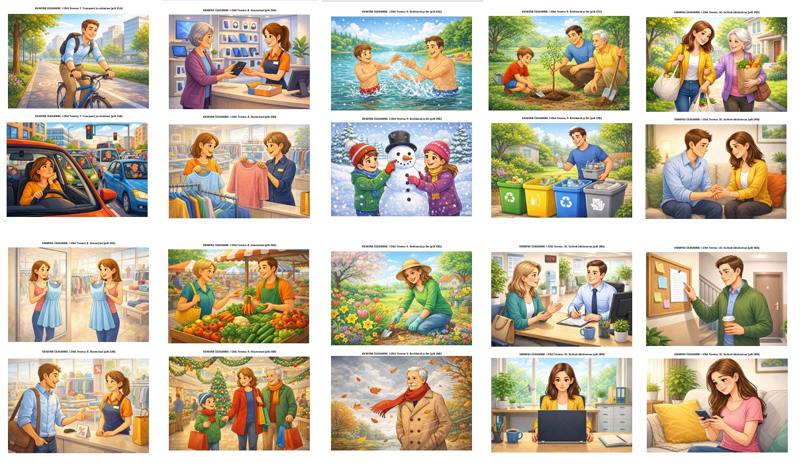

# Rääkimine 1. 

Näidiskirjeldus (Описание картинки)

Описание картинки и ответы на вопросы по теме картинки. На них могут быть изображены люди, события, места, действия и т. д.

## Полезные слова и фразы

Sissejuhatus
Pildil on mees. — На картинке мужчина.  
Pildil on naine. — На картинке женщина.  
Pildil on kaks inimest. — На картинке два человека.  
Pildil on pere. На картинке семья.  
Pildil on laps. — На картинке ребёнок.  

Koht  
Nad on kodus. — Они дома.  
Nad on toas. — Они в комнате.  
Nad on köögis. — Они на кухне.  
Nad on kohvikus. - Они в кафе.  
Nad on pargis. — Они в парке.  
Nad on poes. Они в магазине.  
Nad on tänaval. — Они на улице.  
Nad on koolis. — Они в школе.  
Nad on kontoris. — Они в офисе.  
Nad on rannas. Они на пляже.  

Tegevus  
Nad istuvad laua taga. — Они сидят за столом.  
Nad seisavad. — Они стоят.  
Nad kõnnivad. - Они идут.  
Nad räägivad. — Они разговаривают.  
Ta kirjutab paberile. — Он/она пишет на бумаге.  
Ta loeb raamatut. Он/она читает книгу.  
Ta vaatab telefoni. — Он/она смотрит в телефон.  
Ta joob kohvi. - Он/она пьёт кофе.  
Ta sööb. - Он/она ест.  
Ta töötab arvutiga. — Он/она работает за компьютером.  

Riided   
Tal on seljas sinine särk. - На нём/ней синяя рубашка.   
Tal on seljas jakk. — На нём/ней куртка.  
Tal on seljas mantel. На нём/ней пальто.  
Tal on seljas kleit. — На ней платье.  
Tal on seljas teksad. - На нём/ней джинсы.  
Tema käes on on lilled. - У неё в руках цветы.

Asjad  
Laual on tass.- На столе чашка.  
Laual on telefon. На столе телефон.  
Laual on raamat. На столе книга.  
Tal on käes kott. — У него/неё в руке сумка.  
Tal on käes telefon. — У него/неё в руке телефон.  

Emotsioon  
Ta tundub rahulikkuna. — Он/она кажется спокойным(-ой).  
Ta tundub rõõmsana. — Он/она кажется радостным(-ой).  
Ta tundub keskendununa. — Он/она кажется сосредоточенным(-ой).  
Ta naeratab. - Он улыбается.  

Õpilase mõte  
Ma arvan, et (ta õpib / ta räägib sõbraga / ta töötab).

Aeg või olukord  
Arvatavasti on (päev / õhtu / nädalavahetus).  

## Harno.ee
[`A2_Rääkimine_Esimene_ülesanne.pdf`](https://harno.ee/sites/default/files/documents/2021-06/A2_R%C3%A4%C3%A4kimine_Esimene_%C3%BClesanne.pdf) 

## Пример 1

  
See on pilt perest, kes veedab aega pargis.  
Pildil on ema, isa, poeg ja tütar.  
Nad jooksevad murul ja nendega koos on suur koer, kes tundub väga õnnelik.  
Isa kannab ruudulist särki, punast T-särki, teksapükse ja mugavaid jalanõusid.   
Ema on heledas kampsunis, sinistes teksades ja valgetes tossudes.  
Poiss kannab rohelist jopet ja teksaseid ning tüdrukul on pruun kleit ja mustad kingad.  
Nad kõik naeratavad ja tunduvad rõõmsad. 
Tõenäoliselt pildil on sügis, sest puudel on kollased lehed ja ilm on päikesepaisteline.  
See pere naudib ühist aega ja veedab lõbusalt päeva värskes õhus.

## Пример 2

  
Pildil on kolm noort naist, kes söövad koos restoranis või kohvikus.  
Nad istuvad õues laua taga, selle peal on taldrikud salati ja muude toitudega.  
Ühel naisel on käes klaas vett.  
Kõik naised tunduvad rõõmsad – nad naeratavad ja vestlevad omavahel, võib olla nad on head sõbrad.  
Taustal on palju rohelust, mis näitab, et nad on ilmselt aias või terrassil.  
Mulle tundub, et pildil on suvi, sest naistel on seljas kerge riietus - kleit ja Tsärk ja päikeseprillid.  
Ilm tundub soe ja päikesepaisteline

## Пример 3

  
Pildil on poiss ja naine. Nad on raamatukogus. Poiss istub laua taga. Tal on seljas sinine pusa. Ta kirjutab pastakaga paberile. Ta täidab ühte vormi. Naine istub tema vastas ja naeratab. Tal on seljas helesinine särk. Laual on kaart ja pastakas. On päev.

## Пример 4

  
Pildil on kaks naist. Nad on kohvikus. Naised istuvad laua taga ja räägivad. Nad annavad kätt ja naeratavad. Ühel naisel on seljas roheline jakk ja teksad. Teisel naisel on seljas roosa kampsun ja teksad. Laual on kohvitassid ja telefon. On päev.

## Пример 5

  
Pildil on mees. Ta on trepikojas. Mees seisab seina juures. Ta loeb paberit seinal. Ühes käes on tal kohvitops. Tal on seljas roheline jakk ja sinine särk. Seinal on mitu paberit.
Trepp on mehe taga.

## Пример 6

  
Pildil on noor naine. Ta on kodus diivanil. Tal on seljas roosa särk. Tema käes on telefon. Ta kirjutab sõnumit. Ta naeratab ja tundub rõõmus. Ma arvan, et ta kirjutab sõbrale.
Arvatavasti on õhtu.

## Примеры картинок

[Источник](https://www.facebook.com/share/p/1As6fcxTGt/)

  

---

  

---

   
1. Tutvumine ja isikuandmed  
1A. Noor mees täidab raamatukogus registreerimislehte. Laual on ID-kaart ja pastakas. Töötaja istub leti taga.  
1B. Kaks naist kohtuvad kohvikus esimest korda. Nad tutvustavad ennast ja vahetavad telefoninumbreid.  
2A. Pere istub elutoas: ema, isa, kaks last ja vanaema. Seinal on perefotod.  
2B. Noor naine räägib sõbrale oma perest ja näitab telefonist pilte.  
3A. Klassiruumis tutvustab uus õpilane ennast: ütleb oma nime, vanuse ja elukoha.  
3B. Töötukassas täidab mees ankeeti: nimi, sünniaeg, rahvus, aadress.  

2. Kodu ja elukoht  
4A. Naine koristab kööki: peseb nõusid, laud on puhas.  
4B. Mees tolmuimeb elutuba, diivan ja televiisor on näha.  
5A. Pere elab korteris linnas. Aknast on näha kõrghooned ja bussipeatus.  
5B. Pere elab maamajas. Aias on puud, koer ja jalgratas.  
6A. Noormees kirjeldab oma tuba: voodi, kirjutuslaud, arvuti ja raamaturiiul.  
6B. Naine näitab sõbrale uut korterit: vannituba, köök ja rõdu.  

3. Haridus ja töö  
7A. Õpilane istub klassis ja kirjutab vihikusse. Laual on õpik ja pliiats.  
7B. Õpilased teevad rühmatööd, laual on koolitarbed ja tahvlil matemaatikaülesanne.  
8A. Mees tööintervjuul: istub laua taga, tööandja esitab küsimusi.  
8B. Naine kirjutab kodus oma CV-d arvutis.  
9A. Arst töötab haiglas, kuulab patsiendi südant.  
9B. Kokk valmistab restoranis toitu.  

4. Vaba aeg ja meelelahutus  
10A. Pere jalutab pargis, lapsed sõidavad rattaga.  
10B. Noored mängivad kodus lauamängu.  

---

   

4. Vaba aeg ja meelelahutus  
11A. Sõbrad on kinos ja ostavad pileteid.  
11B. Inimesed vaatavad jalgpallimängu staadionil.  
12A. Naine saadab sõbrale sõnumi: kutsub sünnipäevale.  
12B. Mees räägib telefonis ja ütleb, et ei saa peole tulla. 
 
5. Söök ja jook  
13A. Pere sööb hommikusööki: leib, juust, tee ja kohv.  
13B. Restoranis tellib paar kelnerilt toitu.  
14A. Naine ostab supermarketis puu- ja köögivilju.  
14B. Mees maksab kassas ja paneb toidu ostukotti.  
15A. Noor naine teeb kodus salatit.  
15B. Mees sööb kiirtoitu ja joob limonaadi.  

6. Tervis ja heaolu  
16A. Mees istub arsti kabinetis ja räägib, et tal on peavalu.  
16B. Naine ostab apteegis ravimeid.  
17A. Inimene jookseb hommikul pargis.  
17B. Naine teeb kodus joogat.  
18A. Laps on haige ja lamab voodis, ema toob teed.  
18B. Mees mõõdab kodus palavikku termomeetriga.  

7. Transport ja reisimine  
19A. Inimesed ootavad bussipeatuses bussi.  
19B. Naine ostab rongijaamas piletit automaadist.  
20A. Pere pakib kohvreid enne reisi.  
20B. Turist vaatab linnakaarti ja küsib teed.  

---

  

7. Transport ja reisimine  
21A. Mees sõidab jalgrattaga tööle.  
21B. Naine sõidab autoga ja seisab ummikus.  

8. Sisseostud  
22A. Naine proovib riideid riidepoes.  
22B. Mees küsib müüjalt allahindluse kohta.  
23A. Klient tagastab katkise toote poodi.  
23B. Müüja aitab kliendil leida õige suuruse.  
24A. Turg: inimene ostab värskeid köögivilju.  
24B. Kaubanduskeskus jõulude ajal, palju inimesi ja soodustused.  

9. Keskkond ja ilm  
25A. Talv: lapsed teevad lumememme.  
25B. Suvi: inimesed ujuvad järves.  
26A. Sügis: tuul puhub ja lehed langevad.  
26B. Kevad: aias õitsevad lilled.  
27A. Mees sorteerib prügi.  
27B. Pere istutab puid pargis.  

10. Suhted ühiskonnas  
28A. Inimene saadab ametliku e-kirja.  
28B. Naine räägib ametnikuga teenindusbüroos.  
29A. Naaber aitab vanemat naist kottidega.  
29B. Kaks inimest vabandavad teineteise ees pärast väikest konflikti.  
30A. Mees loeb teadet trepikojas (näiteks veekatkestus).  
30B. Naine kirjutab sõbrale lühikese sõnumi telefonis.