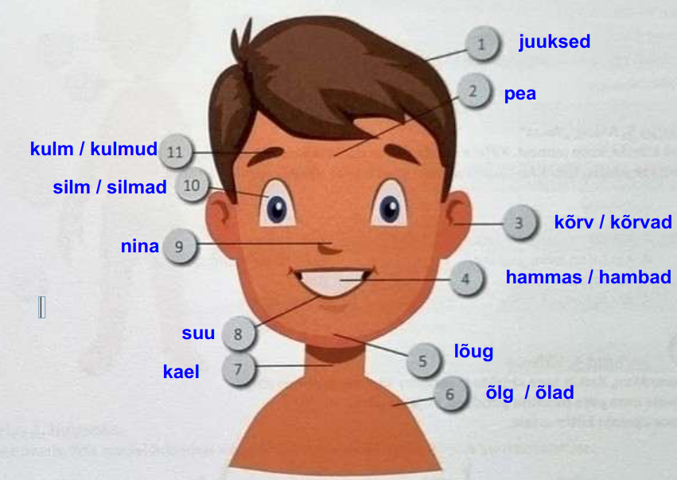
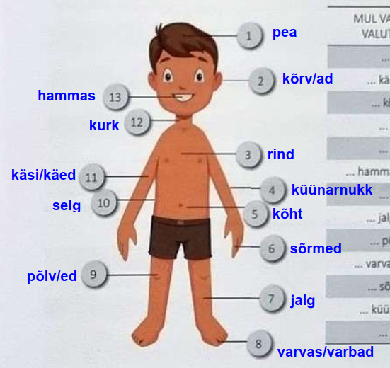

# Части тела, болезни (Kehaosad ja haigused)

## Части лица и тела

  

1. juuksed - волосы  
2. pea - голова  
3. kõrv / kõrvad - ухо / уши  
4. hammas / hambad - зуб / зубы  
5. lõug - подбородок  
6. õlg  / õlad - плечо / плечи  
7. kael - шея  
8. suu - рот  
9. nina - нос  
10. silm / silmad - глаз / глаза  
11. kulm / kulmud - бровь / брови   

nägu - лицо  
põsk / põsed - щека / щеки  
ripse / ripsmed - ресница(ы)  
mokk / mokad - губа / губы  
laup - лоб  
huul / huuled - губа / губы 
habe - борода  
vuntsid - усы  
sünnimärk - родимое пятно  
tätoveering - татуировка   

  

1. pea - голова
2. kõrv / kõrvad - ухо / уши  
3. rind - грудь  
4. küünarnukk(id) - локоть / локти  
5. kõht - живот  
6. sõrm(ed) - палец / пальцы на руке
7. jalg / jalad - нога / ноги  
8. varvas / varbad - палец / пальцы на ноге  
9. põlv(ed) - колено / колени  
10. selg - спина / поясница  
11. käsi/käed - рука / руки  
12. kurk - горло  
13. hammas / hambad - зуб / зубы 

ranne / randmed - запястье/я	  
puus / puusad - бедро / бедра	  
kand / kannad - пятка / пятки	  

## Описательные прилагательные

### juuksed - волосы

pikad - длинные  
lühikesed - короткие  
lokkis - вьющиеся  
sirged - прямые  
heledad - светлые  
tumedad - темные  
pruunid - коричневые  
hallid - седые (серые)  
valged - белые (блонд)  
lainelised - волнистые   

### silmad - глаза

pruunid - коричневые  
sinised - синие  
hallid - серые  
suured - большие  
rohelised - зеленые  
mustad - черные  
ilusad - красивые  
väiksed - маленькие  

### hambad - зубы

terved - здоровые  
kollased - желтые  
puhtad - чистые  
mustad - грязные  
katkised - больные (испорченные)  
sirged - прямые  
kõverad - кривые  

## Болезни
Tal on köha. - У него кашель  
Tal on nohu. - У него насморк  
Tal on palavik ja külmavärinad. - У него жар (температура) и озноб  
Tal on süda paha. - У него тошнота  
Tal on väsimus. - У него слабость (усталость)  
Tal on allergia. - У него аллергия  
Tal valutab hammas. - У него болит зуб  
Tal valutab kurk. - У него болит горло  
Tal valutab kael. - У него болит шея  
Tal valutab kõht. - У него болит живот  
Tal käib pea ringi. - У него головокружение	

Синонимы:  
Tal on peavalu - головная боль  
Tal on kõhuvalu -  боль в животе  
Tal on hambavalu - зубная боль  
Tal on kurguvalu - боль в горле  
Tal on seljavalu - боль в спине  

## Куда пойти / позвонить

**Lähen (kuhu?)**:  
hambaarsti juurde  
silmaarsti juurde  
lastearsti juurde  
kõrvaarsti juurde  
ortopeedi juurde  
apteeki  
EMO-sse  
haiglasse  
polikliinikusse  
kiirabisse  

**Helistan (kellele? Kuhu)**:  
perearstile  
allergoloogile  
kurguarstile  
kirurgile - хирургу  
kiirabisse  
apteeki  
haiglasse  
polikliinikusse  

## Примеры
Kui mul on hambavalu, siis ma lähen hambaarsti juurde. - Когда у меня зубная боль, тогда я иду к стоматологу  
Kui mul on seljavalu, siis ma lähen ortopeedi juurde. - Когда у меня болит спина, тогда я иду к ортопеду  
Kui mul valutavad põlved, siis ma lähen kirurgi juurde. - Когда у меня болят колени, тогда я иду к хирургу  
Kui ma näen halvasti, siis ma lähen silmaarsti juurde. - Когда я плохо вижу, тогда я иду к окулисту  
Kui mul on kurguvalu, siis ma helistan kurguarstile. - Когда у меня болит горло, тогда я звоню лору (горловрачу)  
Kui mul on väga kõrge palavik ja külmavärinad, siis ma helistan perearstile. - Когда у меня очень высокая температура и озноб, тогда я звоню семейному врачу  
Kui mul on süda paha, siis ma helistan kiirabisse. - Когда у меня тошнота, тогда я звоню в скорую помощь  
Kui mul on allergia, siis ma helistan allergoloogile. - Когда у меня аллергия, тогда я звоню аллергологу  
Kui mul valutab küünarnukk, siis ma helistan kirurgile. - Когда у меня болит локоть, тогда я звоню хирургу  
Kui mul on kevadväsimus, siis ma ostan vitamiine. - Когда у меня (весенняя) усталость, слабость, я покупаю витамины  

