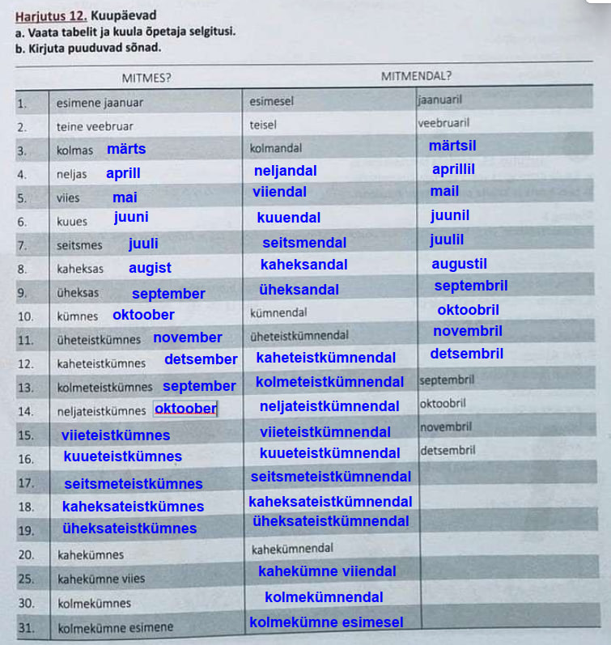
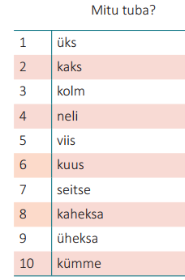
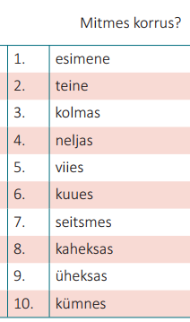
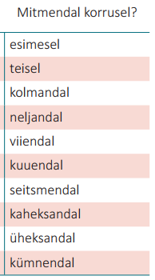

# Числа

| #      | Mis? (1)        | Mille? Omastav (2) | Mitmes? (какой/е?) (3) | Mitmenda? - Чей? Какой? | Mitmendal? Kus? Millal? где? когда? в/на каком? (4) | Kuhu? Millele? куда? на что? (5) |
| ------ | --------------- | ------------------ | ---------------------- | ----------------------- | --------------------------------------------------- | -------------------------------- |
| **1**  | üks             | ühe                | esimene                | esime**se**             | esime**sel**                                        | esimesele                        |
| **2**  | kaks            | kahe               | teine                  | tei**se**               | tei**sel**                                          | teisele                          |
| **3**  | kolm            | kolme              | kolma**s**             | kolma**nda**            | kolma**ndal**                                       | kolma**ndale**                   |
| **4**  | neli            | nelja              | nelja**s**             | nelja**nda**            | nelja**ndal**                                       | nelja**ndale**                   |
| **5**  | viis            | viie               | viie**s**              | viie**nda**             | viie**ndal**                                        | viie**ndale**                    |
| **6**  | kuus            | kuue               | kuue**s**              | kuue**nda**             | kuue**ndal**                                        | kuue**ndale**                    |
| **7**  | seitse          | seitsme            | seitsme**s**           | seitsme**nda**          | seitsme**ndal**                                     | seitsme**ndale**                 |
| **8**  | kaheksa         | kaheksa            | kaheksa**s**           | kaheksa**nda**          | kaheksa**ndal**                                     | kaheksa**ndale**                 |
| **9**  | üheksa          | üheksa             | üheksa**s**            | üheksa**nda**           | üheksa**ndal**                                      | üheksa**ndale**                  |
| **10** | kümme           | kümne              | kümne**s**             | kümne**nda**            | kümne**ndal**                                       | kümne**ndale**                   |
| **11** | üksteist        | üheteistkümne      | üheteistkümne**s**     | üheteistkümne**nda**    | üheteistkümne**ndal**                               | üheteistkümne**ndale**           |
| **12** | kaksteist       | kaheteistkümne     | kaheteistkümne**s**    | kaheteistkümne**nda**   | kaheteistkümne**ndal**                              | kaheteistkümne**ndale**          |
| **20** | kakskümmend     | kahekümne          | kahekümne**s**         | kahekümne**nda**        | kahekümne**ndal**                                   | kahekümne**ndale**               |
| **21** | kakskümmend üks | kahekümne ühe      | kahekümne esimene      | kahekümne esime**se**   | kahekümne esime**sel**                              | kahekümne esimesele              |
| **30** | kolmkümmend     | kolmekümne         | kolmekümne**s**        | kolmekümne**nda**       | kahekümne**ndal**                                   | kahekümne**ndale**               |

1. **Колонка 1 (Mis?):** Просто называем число или считаем предметы (Nimetav).  
2. **Колонка 2 (Mille?):** «Фундамент» (Omastav). Нужна для большинства предлогов, сложных слов и при покупке одного предмета (*ostan ühe pileti*).  
3. **Колонка 3 (Mitmes?):** Какой по счету?. Названия дат, этажей, мест.  
Третий этаж - kolmas  
4. **Колонка 4 (Mitmendal? Kus? Millal?):** На каком по счету? / Какого числа? (место или время). На каком этаже? В каком году? В какой день? (окончание **-l**).  
   На третьем этаже - kolmandal  
5. **Колонка 5 (Kuhu? Millele?):** На какой по счету? (куда? направление). На какой этаж? Кому? На какое время? (окончание **-le**).  
   На третий этаж - kolmandale

## Правила применения

### **(2) Mille?**

* **Принадлежность или описание:** Когда число характеризует следующий за ним предмет.  
* *Kolme korruse maja* — Дом трех этажей (трехэтажный).  
* Kaheaastane laps - Двухлетний ребенок.  
* Kahekorruseline maja. Двухэтажный дом.  
* *Kahe lapse isa* — Отец двух детей.  

* **С предлогами:** Большинство предлогов в эстонском требуют именно этой формы.  
* *Peale **kahe** tundi* — После двух часов.  
* *Enne **viie** päeva* — До пяти дней.  

* **Сложные слова:** Если числительное становится частью другого слова.  
* *Viieaastane* — Пятилетний (viie + aastane).  

- когда к существительному добавляется -ga  
- Tutvu ühe kinokavaga - Ознакомься с одной киноафишей  

- Когда **есть действие** !! для числа **один**  
- _Ma ostan **ühe** pileti._ (Я `покупаю` один билет — здесь _ühe_, потому что есть действие покупки).  
- Ma annan sulle ühe toreda harjutuse - Я `дам` тебе одно замечательное упражнение

### **(3) Mitmes?**

Эта форма отвечает на вопрос **«Который по счету?»**. Мы используем её для дат, этажей, мест в очереди.

* **Даты:** В эстонском языке число месяца — это всегда порядковое числительное.  
* *Täna on **esimene** mai.* — Сегодня первое мая.  

* **Этажи (как название):**  
* *See on **kolmas** korrus.* — Это третий этаж.  

* **Списки и места:**  
* *Ta sai võistlusel **teise** koha.* — Он занял на соревновании второе место.

### **(4) Millele?** 

Направление или нахождение (на этаж, на время, к числу).

это форма **Alaleütlev** (падеж направления «на что-то»). Она образуется по формуле: **Колонка 2 (Omastav) + суффикс -le**.

#### 1. Местоположение 

Ответ на вопрос «На чём? / На какой?»)

Когда мы говорим об этажах, используется падеж **-le/-l**.  
- **Пример:** _Ma elan **kolmandal** korrusel._ (Я живу на третьем этаже).    
- **Пример:** _Tõsta see **teisele** riiulile._ (Положи это на вторую полку).  

### Колонка 5

####  Время (Ответ на вопрос «На какое время? / К какому часу?»)

Используется, когда мы назначаем встречу или указываем временную границу.  
- **Пример:** _Pane aeg **viiele**._ (Запиши на пять [часов]).  
- **Пример:** _Kohtume **kaheksale**._ (Встретимся к восьми).  
    
#### Передача кому-то (Ответ на вопрос «Кому?»)

Если число выступает в роли получателя (например, в математике или при распределении).  
- **Пример:** _Lisa **kahele** kolm._ (Прибавь к двум три).  
- **Пример:** _Andsin **ühele** õuna и **teisele** pirni._ (Дала одному яблоко, а второму грушу).  
    

## Общий принцип на примере `kolm` (`три`)

В эстонском языке от одного числа растут две разные ветки: **количественная** (сколько?) и **порядковая** (который?).

### Полная таблица форм слова "kolm"

| **Ветка**      | **Падеж / Вопрос**               | **Форма**      | **Пример использования**                |
| -------------- | -------------------------------- | -------------- | --------------------------------------- |
| **ОСНОВА**     | **1. Mis? (Nimetav)**            | **kolm**       | Три (просто число).                     |
| **ОСНОВА**     | **2. Mille? (Omastav)**          | **kolme**      | Трех (фундамент: _kolme_ korruse maja). |
| **ПОРЯДОК**    | **3. Mitmes? (Название)**        | **kolmas**     | Третий (номер этажа, номер места).      |
| **ПОРЯДОК**    | Mitmenda?                        | kolmanda       | Третьего места                          |
| **ПОРЯДОК**    | **4. Mitmendal? (Где?)**         | **kolmandal**  | **Третьего числа** или на 3-м этаже.    |
| **ПОРЯДОК**    | **5. Mitmendale? (На какой?)**   | **kolmandale** | **На третье число** или на 3-й этаж.    |
| **КОЛИЧЕСТВО** | **4. Kus? (Где? Когда?)**        | **kolmel**     | **В три часа** или «у троих» (людей).   |
| **КОЛИЧЕСТВО** | **5. Kuhu? (Кому? На сколько?)** | **kolmele**    | **К трем часам** или «трем людям».      |

1. **Число 3 (Количество):**
    - Если ты говоришь о времени (**часы**): _Saame kokku **kolmele**_ (Встретимся к трём).   
    - Если ты говоришь о **людях**: _Ma andsin **kolmele** poisile kommi_ (Я дал трем мальчикам конфеты).  
        
2. **Число 3-й (Порядок):**    
    - Если ты говоришь о **дате**: _Ma sündisin **kolmandal** juunil_ (Я родился 3-го июня).        
    - Если ты говоришь об **этаже**: _Ma elan **kolmandal** korrusel_ (Я живу на 3-м этаже).  
        

> Порядковая ветка всегда длиннее (_kolmandal_), а количественная — короче (_kolmel_).

## Правило построения составных чисел

В составных числах (21, 35, 102) работает «правило очереди»:  
- **Только последнее слово** показывает, что число порядковое (3-я колонка).  
- **Все предыдущие слова** «замирают» в форме **Omastav (2-я колонка)**.  

| **Число** | **Как строим (Логика)** | **Результат (Mitmes?)** |
| --------- | ----------------------- | ----------------------- |
| **20**    | (20 в 3-й колонке)      | **kahekümnes**          |
| **21**    | (20 во 2-й) + (1 в 3-й) | **kahekümne esimene**   |
| **22**    | (20 во 2-й) + (2 в 3-й) | **kahekümne teine**     |
| **30**    | (30 в 3-й колонке)      | **kolmekümnes**         |
| **35**    | (30 во 2-й) + (5 в 3-й) | **kolmekümne viies**    |

## Прилагательные
 вторая форма числа + -`line`

`kolmetoaline` korter. - трехкомнатная квартира  
`ühetoaline` korter. - однокомнатная квартира  
`kolmekorruseline` . - трехэтажный дом  
`viiekorruseline`. - пятиэтажный дом  

Примеры  
`Mitmetoaline korter` see on? See on `kolmetoaline korter`. — Сколькикомнатная квартира это? Это - трехкомнатная квартира

На вопрос какую? вторая форма числа + -`list`  
Я ищу двухкомнатную квартиру	Ma otsin kahetoa`list` korterit.

## Даты. Какое число? Какого числа?

### **Mitmes?** (Какое число?)
3-я форма (-s) и месяц в первой форме  
esimene jaanuar  
teine veebruar  
kolmas märts  
neljas aprill  
kümnes  
üheteistkümnes  
kaheteistkümnes  
viieteistkümnes  
kahekümnes  
kahekümne viies  

### Mitmendal? (какого числа?)
 4-я форма (-dal) и месяц `-l`  
 esimesel jaanuaril  
 teisel veebruaril  
 kolmandal märtsil  
 üheksandal septembril  
 kümnendal oktoobril  
 kolmeteistkümnendal   
 kaheksateistkümnendal  
 kahekümne viiendal novembril  
 kolmekümnendal  
 kolmekümne esimesel
 

## Примеры

### Основа

Я говорю на `трех` языках	Ma räägin `kolme` keelt  
Дом `трех` этажей (трехэтажный)	`Kolme` korruse maja  
Ознакомься с `тремя` киноафишами Tutvu `kolme` kinokavaga  
После `трех` часов  Peale `kolme` tundi

### Порядок (какой? какое?)

Это `третий` этаж	See on `kolmas` korrus  
Сегодня `третье` мая.  Täna on `kolmas` mai  

### Порядок (какого? чьего?)

Обладатель **третьего места**.    `Kolmanda` koha omanik  
Кубок **третьего места**  `Kolmanda` koha karikas  

### Порядок (какого? на каком?)

Я живу `на третьем` этаже	Ma elan `kolmandal` korrusel  
Я родился `третьего` июня   Ma sündisin `kolmandal` juunil  

### Порядок  (куда? на какой?)

Идите `на третий` этаж Minge `kolmandale` korrusele  
Встретимся `третьего` числа  Kohtume `kolmandale`

### Количество (где? когда?)

Я был `на трех` концертах.   Ma olin `kolmel` kontserdil  
`В три` начинается собрание   `Kolmel` algab koosolek

### Количество (на сколько? кому?)

Встретимся `к трем`  Kohtume `kolmele`  
Я дал `трем` мальчикам конфеты   Ma andsin `kolmele` poisile kommi  

### Какой?

Maria vanematel on `kolmetoaline` korter. - У родителей Марии - трехкомнатная квартира  
Nende maja on `kolmekorruseline`. - Их дом - трехэтажный дом  
Marial on `ühetoaline` korter. - У Марии однокомнатная квартира  
See maja on `viiekorruseline`. - пятиэтажный дом

| **Вопрос**                 | **Ответ **           | **Вопрос **                | **Ответ**   |
| -------------------------- | -------------------- | -------------------------- | ----------- |
| **Mitu korrust?**          | **Kolm korrust**     | Сколько этажей?            | Три этажа   |
| **Mitmekorrusaline maja?** | **Kolmekorrusaline** | Сколькиэтажный дом?        | Трёхэтажный |
| **Mitmes korrus?**         | **Kolmas**           | Какой (по счету) этаж?     | Третий      |
| **Mitmendal korrusel?**    | **Kolmandal**        | На каком (по счету) этаже? | На третьем  |

## Mitu

## Mitmes

## Mitmendal
