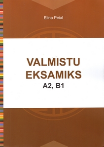

# Материалы по изучению эстонского языка

## О проекте

Данный сайт содержит материалы по изучению эстонского языка.

Информация будет пополняться по мере накопления.

## Полезные ресурсы:

[`Sõnaveeb`. Один из лучших рекомендуемых словарей эстонского языка](https://sonaveeb.ee/)

[`Eesti numbrid`. Тренировка эстонских чисел на слух](https://numbrid.eestikeeles.ee/)

[Keeletee](https://www.keeletee.ee/) – онлайн-курсы для изучения эстонского языка

[Keeleklikk](https://www.keeleklikk.ee/et/welcome) – Бесплатный виртуальный курс эстонского языка для начинающих, проводимый на русском или английском языке.

[Veebipõhised eesti keele tasemetestid](http://web.meis.ee/testest/) – Онлайн-тесты на знание эстонского языка. Проверьте свои языковые навыки перед сдачей экзамена.

[Произношение эстонских гласных - YouTube](https://www.youtube.com/playlist?list=PLGXy0egmRXj7Y1a-uDIDvy02xyj136-DF)

[Pille ja Lauri lood](https://web.meis.ee/vaegkuuljad/index.html)

Книга с материалам для экзамена А2-B1 [Valmistu eksamiks A2, B1. Elina Peial](https://rahvaraamat.ee/et/raamatud/keeleope-ja-sonastikud/eesti-keel/valmistu-eksamiks-a2-b1/2234530)

 